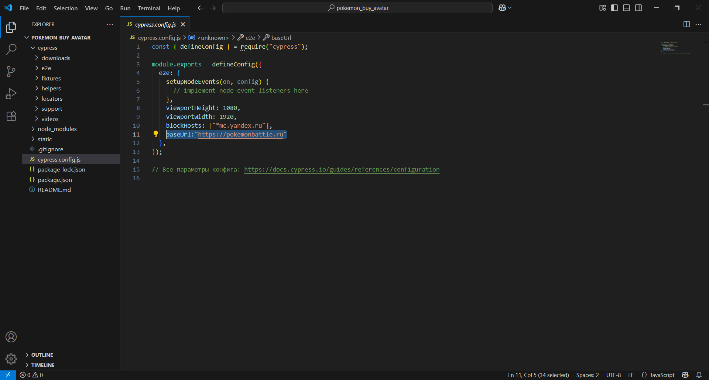
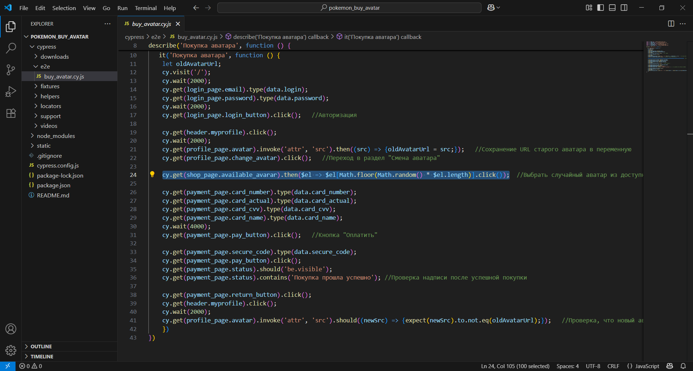
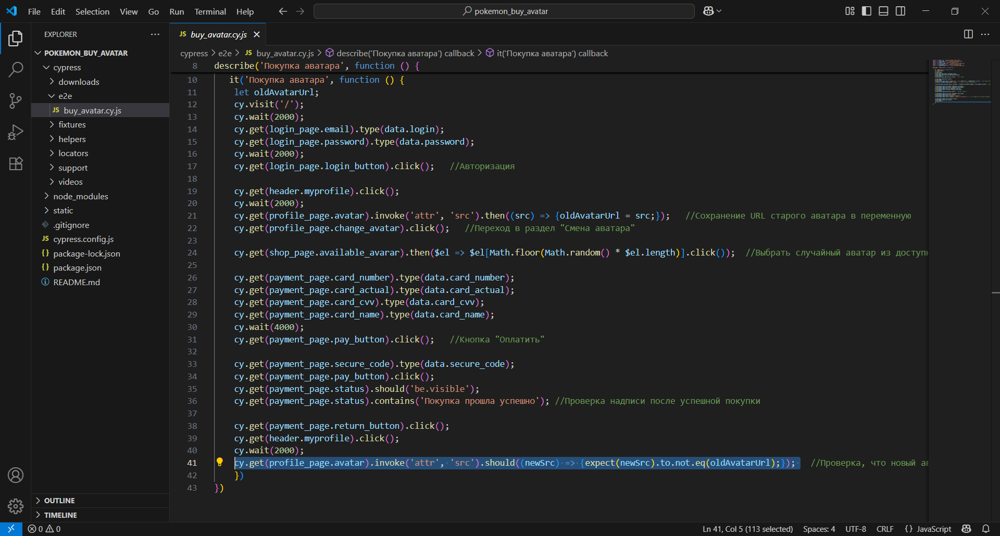
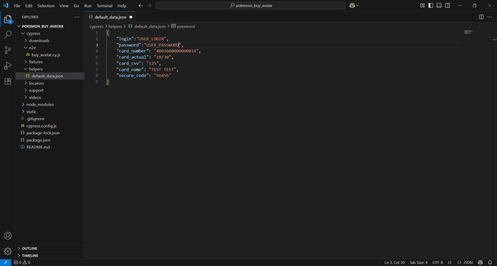
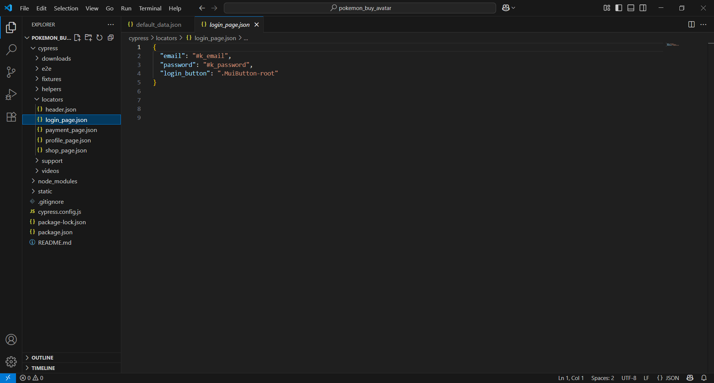
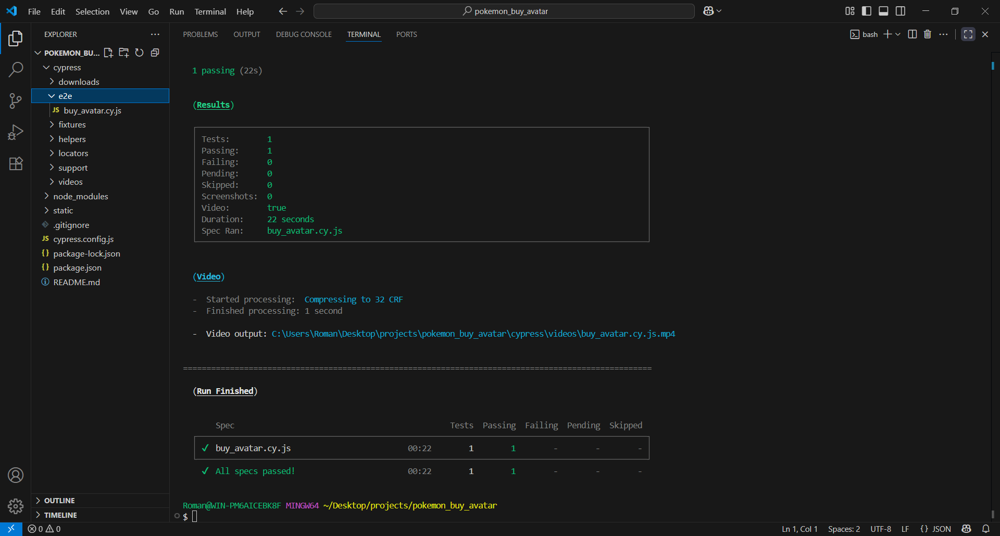
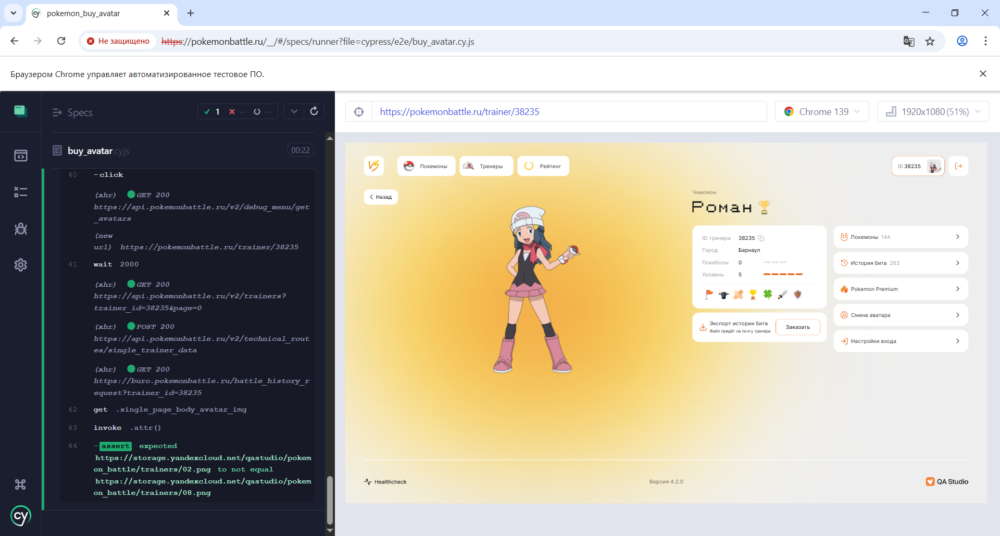

<h2>Сквозной автотест на покупку нового аватара на фреймворке Cypress</h2>

> **Статус проекта:**
> Закрытый проект: https://pokemonbattle.ru/
> 
> 🟢 Поддерживается (активный) 

## Описание проекта и задачи
Автоматизировать тест-кейс на покупку нового аватара с помощью Cypress

## Детали реализации

1. baseUrl вынесен в переменные конфига


2. Применение случайного выбора из доступных аватаров


3. Сравнение ссылок на новый и старый аватар


4. Переменные данные для авторизации вынесены в отдельный файл


5. Каждая страница описана в формате объекта с локаторами


## Локальный запуск теста (из терминала)
1. Скачать проект
2. Перейти в терминале в директорию проекта
2. Выполнить команду:
```
npx cypress run --spec cypress/e2e/buy_avatar.cy.js --browser chrome  
```
Ожидаемый результат: получим отчет о прохождении теста.
<br>
<br>



## Локальный запуск через Cypress UI
1. Скачать проект и открыть в терминале.
2. Перейти в директорию проекта.
3. В терминале в папке с проектом запустить npm `install --save-dev cypress@12.7.0`
4. В терминале в папке с проектом запустить npm `npm i`
5. В терминале в папке с проектом запустить npm `npx cypress open`
6. Выбрать в Cypress UI E2E тестирование и браузер Google Chrome
7. Выбрать спеку buy_avatar

Ожидаемый результат: получим отчет о прохождении тестов.
<br>
<br>

